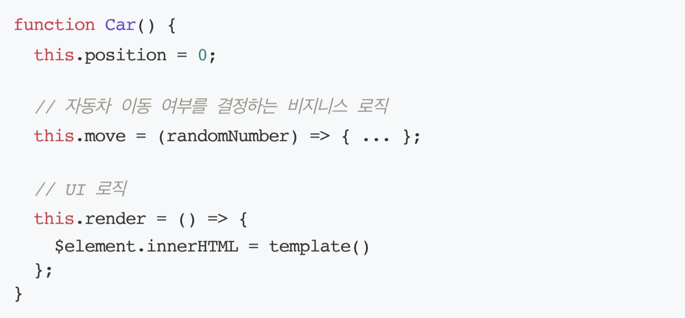

후기:
- 전반적인 리팩토링 과정에서 의미있는 커밋로그를 남기는 것이 매우 어려웠다.
- 의미 있는 상수를 사용하기 위해 노력했다.
- getSum 같은 함수를 이용해서 불필요한 변수를 줄였다.

## 1. 자판기

우아한테크코스 4기의 프리코스 3주차 미션은 자판기 구현이다. 구현 내용은 [프리코스 3주차 미션 저장소](https://github.com/DomMorello/javascript-vendingmachine-precourse/tree/dom)에 업로드했다.

3주차 미션을 진행하면서 고민한 내용들에 대해 개인적으로 공부하고 정리해보았다.

<br>

## 2. 구현 중에 했던 고민들
---

### 2-1. 클래스가 서로 어떻게 상호작용할 것인가?

**여러 개의 클래스를 분리한 후 서로 관계를 맺어 하나의 프로그램을 완성**하는 것이 3주차 미션의 목표이다. 클래스를 어떻게 **객체지향**적으로 분리하고 어떻게 서로 관계를 맺을지를 고민해서 적용했다. 기본적으로 모든 프리코스 과제와 같이 **MVC 패턴**을 유지하려고 노력했다.

이번 주차를 구현할 때는 지난 2주 동안의 미션과는 조금 다른 방향으로 구조를 잡았다. 디렉토리 구조를 MVC 패턴에 맞추기 위해서 view, input, game 이런 식으로 나눠서 진행했었는데 이 방법에 대한 확신이 없었기 때문에 다른 방식으로 시도를 해봤다.

가장 우선시 했던 내용은 가장 **객체가 실제를 담도록 노력**했다.

1. 자판기 객체: 실제 자판기가 가질 수 있는 정보와 행동을 변수와 메서드로 구현.
2. 동전 객체: 동전이 하는 행동과 동전 개수 정보를 담고 있음.
3. 제품 객체: 자판기 객체 안에 추가되는 객체.
4. 유효성 검사 클래스: static 함수로만 구성돼있음.

위의 클래스와 객체들은 각각의 역할이 분명하고 행동과 정보를 전부 적절하게 담도록 했다. 그런데 DOM 노드를 만들어서 초기화하고 이벤트리스너를 어디서 등록하고 해야 할 지는 고민이 많았다.

그래서 전체적으로 프로그램의 구조는 다음과 같다.

> 뷰 초기화 작업 -> 각 뷰에 맞는 이벤트리스너 등록 -> 이벤트 발생시 객체들의 상호작용

이렇게 구조를 만듦으로써 다음 2-2. 의 목적을 이룰 수 있었다.

### 2-2. 비즈니스 로직과 UI 를 분리하라
1,2주차 과제를 진행하면서 **MVC 패턴**을 유지하려고 노력했다. 특히 디렉토리 구조를 명확하게 나눠서 input, view 디렉토리를 두고 UI를 모두 view 디렉토리에 넣고 진행했다. 그런데 2주차 피드백을 보고 이렇게 하는 것이 답은 아니라는 것을 느꼈다.



피드백 내용을 살펴보면 위 사진과 같다. 내가 지금까지 했던 방식과는 다르게 `Car` 클래스 내부에서 UI 로직을 갖고 있는 것을 볼 수 있다. 이 피드백을 받고 지금까지 했던 방식과는 다르게 해보려고 생각했다. 우선 `Car`와 밀접하게 관련된 UI 를 보여주는 함수가 `Car` 클래스 내부에 선언돼 있는 것이 적절하게 보인다. 내가 기존에 했던 방식으로 했을 때는 **View 클래스에 서로 관련 없는 UI 로직이 다 뭉쳐져 있었다**. 이런 부분은 확실히 그 해당 클래스에 역할이 무엇인지를 명확하게 밝힐 수 없는 구조인 것 같다.

그래서 **VendineMachine, Coins, Product** 객체들 각각이 해당 객체의 정보를 갖고 뷰를 렌더할 수 있도록 했다.

> Product.js

```js
...
export default class Product {
  ...
    addedTemplate() {
    return `
      <tr class="${ADDED_PRODUCT_CLASS}"align="center" bgcolor="white" height="40">
        <td class="${PRODUCT_MANAGE_NAME_CLASS}" align="center" width="160">${this.name}</td>
        <td class="${PRODUCT_MANAGE_PRICE_CLASS}" align="center" width="100">${this.price}</td>
        <td class="${PRODUCT_MANAGE_QUANTITY_CLASS}" align="center" width="100">${this.quantity}</td>
      </tr>
    `;
  }

  render(dom) {
    dom.insertAdjacentHTML('beforeend', this.addedTemplate());
  }
  ...
}
```

위 코드를 보면 상품을 추가할 때 뷰를 새롭게 보여줘야 하는데 그 부분을 Product 클래스 내부에 위치시켰다. 해당 뷰는 Product 객체의 정보를 담고 있어야 하고 정확히 Product 객체가 하는 일이기 때문에 피드백의 내용대로 이런 식으로 **뷰와 비즈니스 로직 분리**를 실현했다.

### 2-3. UI에 보여질 상태를 어떻게 관리할 것인가?
이번 주차 과제 요구사항 중 하나는 '**새로고침을 하여도 최근 작업내역이 보여야 한다**'이다. 이는 `localStorage`를 이용해서 마치 백엔드의 DB에 저장된 값을 불러와서 화면을 보여주는 것과 같은 효과를 낼 수 있다. 그런데 어떤 이벤트가 발생했을 때 어떤 클래스의 메서드를 이용해서 뷰를 보여주면 새로고침을 했을 때는 조작된(추가된) DOM 정보가 모두 사라지기 때문에 최근 작업내역을 보여줄 수가 없다.

그래서 이렇게 생각했다. **새로고침을 하지 않고 프로그램을 사용자가 계속 조작하는 경우**와 **새로고침을 했을 때의 경우**를 나눠서 생각했다. 사용자가 새로고침을 하지 않고 입력값을 넣고 하는 등의 문제는 각 클래스에 있는 `render()` 메서드를 사용해서 DOM을 조작하면 된다. 그러면 UI에 보여줄 상태 데이터들을 최신의 상태로 잘 볼 수 있을 것이다.

그렇다면 새로고침을 했을 때는 어떻게 최근 작업내역을 보여줄까? `localStorage`에 최근까지 작업한 내용을 전부 불러와서 view를 render할 때 보여주면 된다. 

> Coins.js

```js
export default class Coins {
  ...
  template() {
    const ids = [
      CHARGE_500_QUANTITY_ID,
      CHARGE_100_QUANTITY_ID,
      CHARGE_50_QUANTITY_ID,
      CHARGE_10_QUANTITY_ID,
    ];
    const title = [TITLE_500, TITLE_100, TITLE_50, TITLE_10];
    return (
      ids.map((id, index) => `
        <tr align="center" bgcolor="white" height="40">
          <td align="center" width="62">${title[index]}</td> 
          <td id="${id}" align="center" width="62">${this.coins[index]}개</td>
        </tr>
      `).join('')
    );
  }

  render(dom) {
    const $table = $(`#${dom}`);

    $table.innerHTML = `
      ${coinListHeaderTemplate()}
      ${this.template()}
    `;
  }
  ...
}
```
위 코드를 보면 사용자가 잔돈을 반환했을 때 위 코드의 `render` 메서드를 실행해서 뷰를 업데이트한다. 이렇게 사용자가 새로고침을 하지 않고 직접 조작할 때 즉각적으로 뷰를 업데이트 해준다. 그러면 다른 탭을 갔다가 돌아오는 경우나 새로고침을 했을 때는 어떻게 할까?

그 때는 최초 렌더를 할 때 `localStorage`에서 받아온 데이터를 갖고 있는 객체의 내부 데이터를 사용해서 아래와 같이 보여주면 된다.

> renderCharge.js

```js
...
function coinListTemplate(change) {
  const coins = JSON.parse(localStorage.getItem(COINS_STORAGE_KEY));
  const titles = [TITLE_500, TITLE_100, TITLE_50, TITLE_10];
  const ids = [
    CHARGE_500_QUANTITY_ID,
    CHARGE_100_QUANTITY_ID,
    CHARGE_50_QUANTITY_ID,
    CHARGE_10_QUANTITY_ID,
  ];
  return (
    ids.map((id, index) => `
      <tr align="center" bgcolor="white" height="40">
        <td align="center" width="62">${titles[index]}</td> 
        <td id="${id}" align="center" width="62">${coins ? `${change.coins[index]}개` : ''}</td>
      </tr>
    `).join('')
  );
}
...
```
위 `coinListTemplate` 함수를 보면 매개변수로 `change`를 받아온다. 이 `change`가 `Coins` 클래스의 객체이다. 해당 객체를 초기화 할 때 `localStorage`에서 값을 가져와 저장하기 때문에 최근의 정보들을 전부 갖고 있다.

그래서 그 정보를 이용해서 `change.coins[index]` 처럼 값을 보여주면 된다.

이렇게 하면 사용자가 직접 조작할 때는 해당 부분만 업데이트를 해주고 새로고침을 하거나 다른 탭에서 돌아올 때는 최근 정보를 갖고 있는 객체의 변수를 이용해서 뷰를 보여주면 일관된 데이터를 보여 줄 수 있다.

### 2-4. DOM append 이후 참조에 대한 문제
DOM 노드를 만들어서 보여줄 때 어떤 문제를 발견했다. 이러한 문제가 발생하는 원인에 대해서 깊이있게 공부하진 못했지만 합리적인 추측이 가능했다. 문제는 다음과 같다.

> initProductAdd.js

```js
function renderProductAddList($productAdd) {
  const $listContainer = document.createElement('div');

  $listContainer.innerHTML = `
    <h3>${PRODUCT_LIST_TITLE}</h3>
    <table id="${PRODUCT_LIST_TABLE_ID}" bgcolor="black" border="1" style="border-collapse:collapse;">
      <tr align="center" bgcolor="white" height="40">
        <td align="center" width="160">${PRODUCT_NAME_TITLE}</td>
        <td align="center" width="100">${PRODUCT_PRICE_TITLE}</td>
        <td align="center" width="100">${PRODUCT_QUANTITY_TITLE}</td>
      </tr>
    </table>
  `;
  $productAdd.append($listContainer);
  console.log('test: ', document.querySelector(`#${PRODUCT_LIST_TABLE_ID}`));
  ...
}
```
위 코드를 보면 `innerHTML` 함수를 이용해서 새로운 `<table>`을 만들어서 새로 생성한 `<div>` 에 `append`해서 화면을 구성한다.

그런데 쉽게 생각했을 때 코드가 순서대로 실행되면서 DOM 노드를 만들어서 조작 과정을 전부 마치고 `console.log()`로 생성된 DOM 노드를 참조해서 출력하는 것이니까 정상적으로 작동할 것처럼 보인다.

하지만 결과는 `test: null` 이 출력된다. 즉, DOM 노드를 생성해서 조작하는 과정을 다 거쳤지만 그 직후 참조를 하려고 하면 해당 노드를 참조할 수 없다.

여기서 신기한 점은 만약에 `setTimeout` 함수를 이용해서 `console.log()` 부분을 지연실행시키면 어떻게 될까?

```js
function renderProductAddList($productAdd) {
  const $listContainer = document.createElement('div');

  $listContainer.innerHTML = `
    <h3>${PRODUCT_LIST_TITLE}</h3>
    <table id="${PRODUCT_LIST_TABLE_ID}" bgcolor="black" border="1" style="border-collapse:collapse;">
      ${productListHeaderTemplate()}
    </table>
  `;
  $productAdd.append($listContainer);
  setTimeout(() => {
    console.log('test: ', document.querySelector(`#${PRODUCT_LIST_TABLE_ID}`));
  }, 0);
  ...
}
```
위 코드에서 변경된 부분은 `console.log()` 부분이 `setTimeout` 함수 안으로 이동한 것 뿐이다. 이렇게 수정한 결과 정상적으로 콘솔에 해당 DOM node를 참조할 수 있었다.

이렇게 되는 이유를 깊이 있게 탐구하지는 못했지만 다음과 같을 것이다.

JS는 코드를 한 줄 한 줄 내려가면서 실행한다. `innerHTML` 함수를 실행하고 `append`함수를 실행한다. 그렇게 정상적으로 DOM node가 생성되었을 것이다. 하지만 그 직후 바로 해당 DOM node를 참조하면 참조할 수가 없다. 아마도 **document.querySelector가 실제로 브라우저에 렌더링된 DOM 노드를 참조하려고 하는데 아직 렌더링과정까지는 완료가 안 됐기 때문**이다.

브라우저는 DOM 을 파싱하고 렌더링하는 일련의 과정을 거치는데 그 과정에 시간이 걸리는 것이다. 그래서 `setTimeout`으로 지연 실행시켰을 때는 정상적으로 작동한 것이다. 

그렇다면 이 문제를 어떤 방식으로 해결해야 할까?

위와 같이 `setTimeout`으로 지연실행시키면 되겠지만 정확히 어떤 식으로 문제가 해결돼서 동작하는지 확신이 없기 때문에 더 안전한 방법을 찾아야 한다.

위의 코드에서 `querySelector`로 DOM 노드를 참조하려는 이유는 `localStorage`에 있는 데이터를 가져와서 있으면 보여주기 위해서였다. 그런데 이 의도를 다른 방법으로 구현하면 문제 해결이 가능했다.

**template literal안에서 map 함수를 통해 배열을 만든 후 `join`함수로 문자열로 만들면 된다.**

```js
function productListTemplate({ name, price, quantity }) {
  return `
    <tr align="center" bgcolor="white" height="40">
      ...
    </tr>
  `;
}

function renderProductAddList($productAdd) {
  const $listContainer = document.createElement('div');
  const products = JSON.parse(localStorage.getItem(PRODUCTS_STORAGE_KEY))
    ?.map((product) => productListTemplate(product))
    .join('');

  $listContainer.innerHTML = `
    <h3>${PRODUCT_LIST_TITLE}</h3>
    <table id="${PRODUCT_LIST_TABLE_ID}" bgcolor="black" border="1" style="border-collapse:collapse;">
      ${productListHeaderTemplate()}
      ${products || ''}
    </table>
  `;
  $productAdd.append($listContainer);
}
}
```
위 코드를 보면 `localStorage`에서 데이터를 가져와서 하나의 문자열로 만들어 `products`라는 변수에 저장한다.
그 다음에 그것을 그냥 **template literal 안에 추가**하는 것으로 의도를 정확하게 구현할 수 있었다.

### 2-5. 탭 구현에 대한 고찰
탭을 구현하기 위해서 이런 방법을 생각했다. 처음에 모든 DOM 을 생성하여 렌더링한다. 그런데 여기서 기본값으로는 상품 추가 탭 화면만 먼저 보여주고 잔돈 추가, 상품 구매 뷰는 `hidden` 속성을 이용해서 가려두는 것이다. 이렇게 하면 탭을 누를때마다 그 탭에 해당하는 전체 뷰를 다 지우고 다시 생성해서 보여줄 필요가 없기 때문이다.

간략하게 설명하자면, 
1. 상품 구매 뷰를 보여준다.
2. 잔돈 추가 뷰를 보여준다.
3. 상품 구매 뷰를 보여준다.
4. 세 개의 뷰를 `hidden` 속성으로 가린다.
5. 현재 탭에 대한 뷰만 `hidden` 속성을 지워 보여준다.

이렇게 하는 것이 탭을 누를때마다 새로운 뷰를 생성해서 보여주는 것보다 더 효율적이고 좋을 것이라고 생각했다.

그러면 업데이트되는 뷰들은 어떻게 해야 할까? 예를 들어 상품 추가 탭에서 상품을 추가하면 표에 추가한 상품이 추가돼야 한다. 처음 뷰를 보여줄때 모든 DOM 을 생성했기 때문에 그 DOM에 추가해서 업데이트할 DOM만 데이터를 반영해서 업데이트 해주면 된다.

이렇게 DOM이 업데이트 되는 부분들의 시작은 무엇일까? 바로 **이벤트리스너**이다. 이벤트가 발생했을 때 해당 탭의 DOM을 업데이트 해주면 되는 것이다. 그런데 한 가지 예외 상황을 맞닥뜨리면서 이런 뷰 설계에 문제가 있다는 것을 깨달았다.

**상품 추가 탭에서 상품을 추가하면 상품 추가 탭의 상품 현황 DOM만 업데이트 되는 것이 아니라 상품 구매 탭의 구매할 수 있는 상품 현황 DOM도 업데이트가 돼야 하는 것**이다.

그러면 상품 추가 탭에서 상품을 추가하는 이벤트가 발생했을 때 상품 구매 탭의 표를 업데이트 해줘야 하는 상황이다.

나는 이 상황이 마음에 들지 않았다. 상품 추가하는 이벤트를 처리하는 함수에서 상품 구매의 뷰를 업데이트해줘야 하기 때문에 해당 함수가 할 일을 벗어나는 느낌이다. 해당 함수의 의도된 역할을 넘어서서 다른 일까지 하게 되므로 이 설계에는 문제가 있다고 생각했다.

리액트를 생각해보면 각 탭에서 보여주는 뷰들을 하나의 컴포넌트로 볼 수 있다. 각 컴포넌트는 고유의 state값을 갖고 해당 state값들을 백엔드에서 불러와서 최신화된 데이터들을 뷰에 보여주는 방식으로 구현이 가능하다. 이렇게 하기 위해서는 이 프로그램에서는 객체가 갖고 있는 정보를 보여주는 것이 가장 적절하다.

이런 생각들을 기반으로 해서 기존에 했던 방식을 바꿨다. 처음부터 전부 다 뷰를 렌더하는 것이 아니라 현재 **탭 정보만 누를때마다 뷰를 새로 업데이트해서 렌더하는 것**이다. 이렇게 한다면 해당 뷰에서 다룰 데이터는 해당 뷰에서만 다룰 수 있다. 그러고 객체에 저장된 데이터를 각 뷰에서 접근하기 때문에 데이터의 일관성도 잘 유지된다.

탭을 눌러서 다른 뷰를 보려고 하면 현재 보이는 DOM을 삭제해버린다. 그리고나서 새롭게 보여질 뷰를 만들어서 보여준다. 리액트도 이런 식으로 컴포넌트를 보여주기 때문에 이런 방식으로 구현했다.

## 3. Javascript
---

### 3-1. Localstorage
`localStorage`를 사용하면 웹 브라우저에 데이터를 저장하고 사용할 수 있기 때문에 페이지가 새로고침이 되더라도 값을 유지할 수 있는 장점이 있다. 그런데 localStorage를 사용할 때 주의할 점이 있다.

`localStorage`는 값을 저장할 때 전부 `string`으로 변환해서 저장한다. 값을 불러올 때도 저장된 값이 `string`이니까 당연히 문자열로 데이터를 가져온다. 그런데 **데이터가 만약에 객체라면 어떻게 사용해야 할까?**

```js
> localStorage.setItem('obj', {a: 1, b: 2})
undefined
> localStorage.getItem('obj')
"[object Object]"
```

위 예시를 보면 객체를 그대로 `localStorage`에 저장하려고 하면 객체를 문자열로 변환해서 저장하게 된다.

```js
> String({a: 1, b: 2})
"[object Object]"
```
이렇게 변환되기 때문에 객체에 담은 데이터를 전혀 쓸 수 없게 되는 버그를 만들게 된다. 이러한 문제를 해결하기 위해서 **JSON.parse 와 JSON.stringify** 함수를 사용해야 한다.

```js
> localStorage.setItem('json', JSON.stringify({a: 1, b: 2}))
undefined
> JSON.parse(localStorage.getItem('json'))
{a: 1, b: 2}
```
`JSON.stringify` 함수를 이용해서 객체의 정보를 그대로 담은 문자열로 변환(직렬화)을 해서 저장하고 값을 불러올 때는 `JSON.parse`를 통해서 문자열로 된 객체를 실제 객체로 변환(역직렬화)해서 사용하면 객체가 갖고 있는 데이터에 의도한대로 접근할 수 있다.

### 3-2. innerHTML vs insertAdjscentHTML
innerHTML 을 사용하게 되면 코드 가독성이 높아진다는 장점이 있다. 문자열들을 전부 DOM 노드로 파싱해서 새롭게 노드를 만들어준다.

그런데 [MDN 공식문서](https://developer.mozilla.org/ko/docs/Web/API/Element/innerHTML)를 보면 다음과 같은 말이 있다.

> 요소(element)의 내용을 변경하는 대신 HTML을 문서(document)에 삽입하려면, insertAdjacentHTML() 메서드를 사용하십시오.

innerHTML을 사용해서 기존의 뷰 일부를 업데이트하면 문제가 발생한다. 만약에 업데이트 하는 뷰에 이벤트리스너가 등록돼있으면 전부 삭제해버리는 것이다. **innerHTML은 내부적으로 기존에 있던 노드를 전부 삭제하고 새롭게 만들기 때문에 이벤트 리스너까지 전부 삭제가 된다.**

그래서 공식문서의 제안대로 상품을 추가하는 부분에는 `insertAdjacentHTML` 함수를 사용해서 구현했다.

## 4. Git
---

### 4-1. 직전 커밋 수정하기
README 를 수정할 일이 있어서 수정을 한 후에 `commit`을 한 상황이다. 그런데 파일에 오타가 있다는 것을 발견하고 방금 commit한 내용에 대해서 수정하고 싶을 수 있다.

이런 상황에서 아주 간단하게 적용할 수 있는 명령어가 있다.

이미 알고 있는 명령어였지만 보통은 직전의 커밋 메세지의 내용을 수정할 때 쓰곤 했다.

`git commit --amend` 를 사용해서 명령어를 입력하면 직전의 커밋로그 작성하던 텍스트 편집기가 화면에 보인다. 이제 커밋로그를 수정한 다음에 저장하면 commit message가 수정돼서 로그에 저장된다.

그런데 만약에 코드를 바꾼다거나 어떤 수정이 필요할 떄는 어떻게 할까?

아주 간단하다. **바로 직전의 커밋을 수정하는 상황**이라면 현재 상태에서 수정하고 싶은 파일을 수정한다. 그리고 나서 `git add <수정한 파일>` 을 해주고 `git commit --amend`를 해주면 똑같이 커밋로그를 작성하는 텍스트 편집기가 화면에 보인다. 이제 메세지를 수정할거면 수정하고 아니면 그대로 저장하면 커밋에 수정사항이 반영돼서 수정된다.

## 5. 우아한테크코스 4기 프리코스 후기
---

3주 동안 프리코스를 진행하면서 구현하면서 자연스럽게 습관이 된 긍정적 변화들이 있다.

### 의미 있는 단위의 커밋 로그 만들기
첫번째로, **의미 있는 커밋 단위**를 만들려고 노력하게 됐다. 팀 프로젝트를 할 때도 커밋로그를 신경쓴다고 했지만 이 정도로 세분화하고 타인을 배려하는 마음으로 해 본 적은 없었다. 그런데 미션들을 구현하면서 누군가가 내 코드를 볼 때 빠르고 정확하게 의도와 흐름을 파악할 수 있게 의미 있는 단위로 커밋을 나누기 위해 노력했다.

물론 이게 쉽지는 않았다. 왜냐하면 기능목록을 미리 만들어 놓고 구현을 하다보면 버그를 발견하거나 지금 기능과는 관련이 없지만 어떤 실수를 발견할 때가 많기 때문이다. 이런 상황들을 직면할 때마다 커밋을 어떤 식으로 나눠야 할까를 고민하는 것 자체가 좋은 개발자로서 한 걸은 더 다가서는 성장이라고 생각한다.

구현을 어느 정도 완료하고 잘 정돈된 커밋로그를 보면 내가 어떻게 개발을 해왔는지를 한 눈에 볼 수 있고 이런 부분들이 **협업하는 다른 개발자에게는 좋은 배려**로 다가갈 것 같다.

### 코딩 컨벤션과 클린코드
둘째로, **코딩 컨벤션**을 유지하려고 노력하게 됐다. 나의 경우는 [Airbnb 코딩컨벤션](https://github.com/ParkSB/javascript-style-guide)을 선택했는데 문서에 보면 컨벤션에 대한 이유들이 적혀있다. 이에 더해서 [클린코드 javascript](https://github.com/qkraudghgh/clean-code-javascript-ko) 를 컨벤션이라고 생각하고 원칙들을 항상 적용하려고 노력하게 됐다. 컨벤션과 클린코드 원칙은 서로 깊은 연관이 있다고 생각한다. 그래서 이 두 개의 문서를 코딩 구현하면서 반복해서 보고 적용하려고 노력했다.

이러한 컨벤션을 유지하려고 노력하면서 **다른 개발자가 봤을 때 가독성이 좋은 코드**를 만들기 위해서 노력하는 습관에 힘을 더해주는 것 같았다. 또한 컨벤션과 클린코드 원칙에는 버그를 최소화하고 안전한 프로그래밍을 할 수 있도록 하는 장치들이 녹아있다고 생각해서 앞으로 코딩을 할 때 항상 가져가야할 습관이라고 생각한다.

### 설계와 살아있는 문서
셋째로, **설계와 계획을 먼저하고 구현**에 들어가는 습관이 생겼다. 원래도 설계와 계획이 어느 정도 있고 구현에 들어간 것은 맞지만 미션을 구현하는것처럼 상세한 **기능구현목록을 작성**해 보는 것이 전체 프로그램이 어떤 모습이 될까를 그리는데 큰 도움이 되었다. 세부적인 디테일까지 전부 설계하고 계획하는 것은 아니지만 어떤 문제를 파악하고 이를 해결하기 위해서 코드를 만들 때 큰 그림을 그리는 연습이 많이 되었다.

그리고 무엇이든 계획은 완벽할 수가 없다. 항상 구현하면서 미처 생각하지 못했던 예외상황 등을 발견하게 되고 계획은 수정돼야 할 떄가 있다. 그럴 때면 기능 구현 목록을 수정해서 **살아있는 문서**를 만들었다. 개발 문서가 단순히 계획으로 그치는 것이 아니라 개발 과정도 반영하게 되면서 계획을 다시 한 번 돌아보고 또 다시 계획하고 구현하는 사이클이 반복되면서 더 안전하고 생산성있는 방식으로 코딩을 하게 된 것 같다.

### 디자인 패턴과 프로그래밍 방법론
넷째로, 원래는 크게 생각해보지 않았던 **디자인 패턴과 프로그래밍 방법론**에 대해서 생각해보게 되는 시간이었다. 사실 이 부분이 가장 아직도 모르겠고 충분히 학습된 부분이 아니라 아쉬움이 많이 남는 부분이다. JS를 이용해서 React를 한 번 다뤄보긴 했지만 VanillaJS 로만 프로그램을 만드는 것이 처음이라 한 주의 미션을 깔끔하게 완성하는 것 자체가 빠듯했다.

하지만 그 시간 안에서 어떤 식으로 프로그램의 구조를 설계해야 가장 좋고 효과적일까를 생각하는 시간에 **MVC 패턴, 객체지향 프로그래밍**등에 대해서 알게 됐다. 아직 디자인 패턴이나 어떤 프로그래밍 방법론에 대해서 깊이 있게 학습하지는 못했지만 개괄적으로 어떤 것인지에 대해서 알게 되었고 앞으로 내가 더 알아가야할 숙제가 생긴 것 같아서 기쁘다.

이런 이론들을 공부하면서 왜 이런 이론들이 만들어졌고 어떻게 구조를 만들어야 견고하고 효과적인 프로그램을 만들 수 있을까를 고민했다. 피드백에 이런 구조를 만드는 내용에 대한 것은 없었기 때문에 사실 프리코스가 끝나는 이 시점에서도 이 부분은 전혀 궁금증이 해소되지 않은 상태로 남아있다. 하지만 앞으로 내가 알아가고 해결해야갈 과제라고 생각한다.

### 아쉬운점
프리코스를 진행하면서 공통 피드백을 받아서 나에게 해당되는 부분에 대해서 개선하고 성장하는 부분은 가장 좋았다. 그런데 바로 위에서 썼듯이 어떤 구조에 대한 피드백은 없었기 때문에 내가 하고 있는 방법에 대한 의문은 계속 들었다. 그렇다고 해서 소프트웨어를 만드는데 정해진 답은 없기 때문에 답을 바라는 것은 아니다. 하지만 같이 하고 있는 **동료나 숙련된 개발자로부터의 피드백같은 것이 있었다면 훨씬 더 좋은 피드백이 됐을 것 같은 아쉬움**이 남는다.

일주일을 집중해서 만든 프로그램이라 그런지 코드 하나하나에 정성이 많이 들어간만큼 개선될 부분에 대해서 코드리뷰를 받을 수 있는 기회가 있었다면 여러 사람의 생각을 공유하고 흡수하여 더 큰 성장을 했을 것 같은 생각이 든다.

한 가지 더 아쉬운 점은 **다른 사람들의 코드를 충분히 공부하지 못했다는 것**이다. 프리코스를 하면서 스스로 원칙을 하나 세웠다. 프로그램을 만들기 전에 어떤 사람의 코드도 보지 않고 내 스스로 생각해보고 만들어보려고 했다. 그렇게 하다보니까 코드를 완성하고 나서 다른 사람의 코드를 볼 수 있었다. 그런데 생각보다 시간이 오래 걸렸고 다른 사람들이 제출한 코드를 분석하고 공부할 시간이 생각보다 부족했다.

그렇기 때문에 다른 사람의 코드를 보고 이런 방식으로 접근했구나를 느끼지만 제출 시간때문에 코드를 수정한다거나 보수하는 과정이 쉽게 되지는 않았다. 그래서 프리코스에 합격해서 집중해서 만든 여러 사람들의 코드를 공부하고 리뷰하면서 서로 성장하는 기회들이 있었으면 좋겠다.

## References

- 모던 자바스크립트 Deep Dive (이웅모 저)
- [클린코드 Javascript](https://github.com/qkraudghgh/clean-code-javascript-ko)
- [모던 자바스크립트 튜토리얼](https://ko.javascript.info/)
- [LocalStorage](https://www.daleseo.com/js-web-storage/)
- [NAVER D2 - 브라우저는 어떻게 동작하는가?](https://d2.naver.com/helloworld/59361)
- [git commit 수정하기](https://mizzo-dev.tistory.com/entry/git-commit-edit)
- [MDN - innerHTML](https://developer.mozilla.org/ko/docs/Web/API/Element/innerHTML)
- [MDN - insertAdjecentHTML](https://developer.mozilla.org/ko/docs/Web/API/Element/insertAdjacentHTML)
