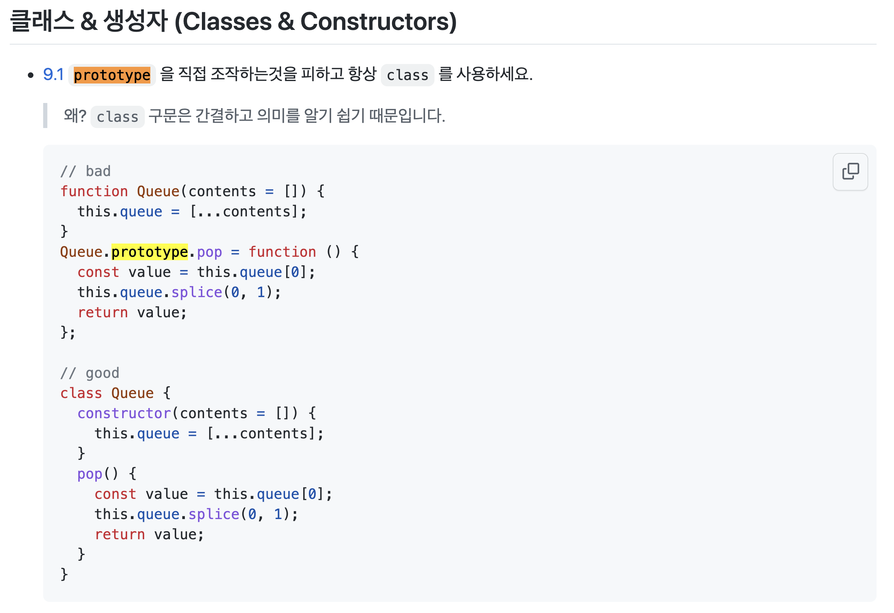
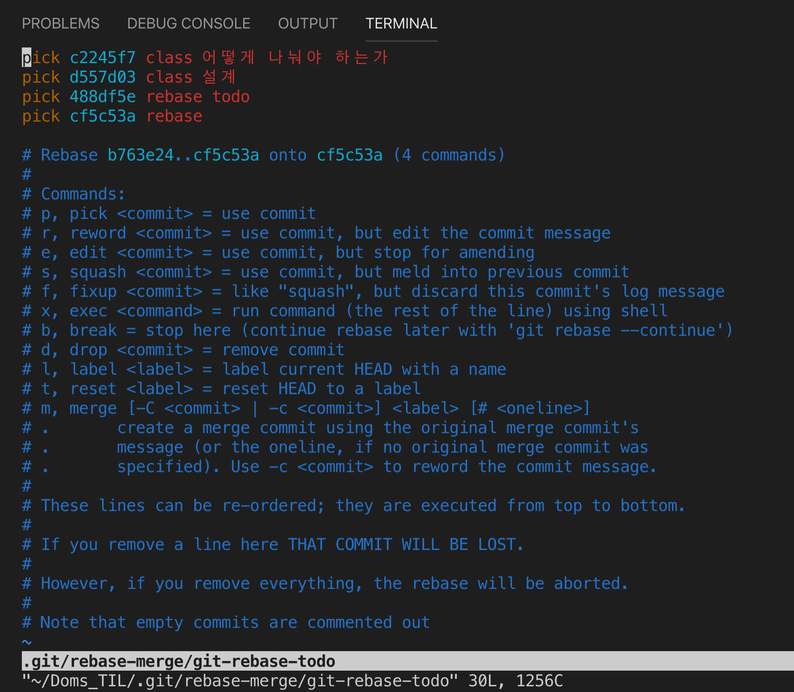

후기: README 상세히 작성하라고 해서 잘 한 사람의 포맷을 가져와서 md문법을 공부해서 작성함
클래스를 만들긴 했는데 객체지향의 개념에 적용이 어려웠다. 그래서 결국엔 원래 하던 방식으로 함수를 쪼개서 하는 방향으로 갔다. 그러고나서 모든 로직과 함수를 만들어놨으니 이를 클래스로 구현해보려고 했다. 

## 1. 자동차 경주 게임

---

우아한테크코스 4기의 프리코스 2주차 미션은 자동차 경주 게임 구현이다. 구현 내용은 [프리코스 2주차 미션 저장소](https://github.com/DomMorello/javascript-racingcar-precourse/tree/dom)에 업로드했다.

2주차 미션을 진행하면서 고민한 내용들에 대해 개인적으로 공부하고 정리해보았다.

<br>

## 2. 구현 중에 했던 고민들

---

### 2-1. 클래스를 어떤 구조로 나눠야 할까?

**클래스를 분리하는 것**이 2주차 미션의 목표이다. 클래스를 분리한다면 클래스를 통해 인스턴스를 만들어서 사용하는 구조를 만들어야 하는데 바로 **객체지향**이라는 키워드가 떠올랐다. 평소에 관심도 갖지 않았고 실습도 해 본 적이 없었기 때문에 이 키워드에 대해서 먼저 알아봐야겠다고 생각했다.

[우아한형제들 기술블로그](https://techblog.woowahan.com/)에 [생각하라, 객체지향처럼](https://techblog.woowahan.com/2502/) 이라는 제목의 글이 객체지향이 무엇인지 쉽게 설명을 해놨다. 그 글을 읽으면서 객체지향이 무엇인지에 대해서 알아보는데 해당 글에서 드는 예시가 이번 주에 만드는 자동차 경주와 어느 정도 비슷하다고 생각했다.


위 글에서는 커피전문점에서 커피를 주문하는 상황을 하나의 도메인으로 가정하고 설명을 하는데 이 상황을 자동차 경주 게임에 대입할 수 있다.

1. 사용자의 입력(주문)을 받아서 게임을 시작하기 때문에 바리스타 객체를 **Input 객체**로
2. 만들어져야 하는 객체들인 커피 객체는 **Car 객체**로
3. 자동차를 움직여서 경주를 진행하고 결과를 내는 **gameController 객체**를 만든다.
4. 마지막으로 전광판처럼 걸과를 보여줄 **View 객체**를 만든다.

**객체지향 세계에서는 모든 객체들이 능동적이고 자율적인 존재로 생각해야 한다**고 한다. 그래서 동물이 아닌 것도 '의인화' 해서 생각해야 한다고 하는데 그래서 Input을 바리스타처럼, 게임을 진행하는 것이 마치 아이가 자동차들을 갖고 노는 것이라고 생각해서 GameController로하고 전광판이 게인 진행상황을 관중들에게 보여준다고 생각해서 View로 했다.

위 글에서 객체지향 설계를 할 때 **'협력을 설계할 때는 객체보다는 메시지를 먼저 선택하고 그 후에 메시지를 수신하기에 적절한 객체를 선택해야 합니다'** 라고 말한다.

프로그램에서 필요한 메시지들을 순차적으로 나열해 보면 다음과 같다.

1. 입력을 받아라. (Input 객체가 예외를 처리하고 입력값을 저장한다)
2. 경주할 자동차들을 만들어라. (Input의 정보를 이용해 CarController가 Car 객체를 생성한다)
3. 경주를 시작해라. (CarController 객체가 Car객체를 이용해 경주를 시작한다)
4. 결과를 보여줘라. (CarController로부터 결과를 받아와서 View 객체를 이용해 화면을 보여준다)

전반적인 디렉토리 구조를 보면 지난 주차에 새로 배워서 적용해봤던 **MVC 패턴**을 유지하려고 노력했다. 사용자의 입력값을 받고 예외를 처리해주는 **input 디렉토리가 Model**, 비즈니스 로직을 진행하는 **game 디렉토리가 Controller**, 이를 바탕으로 데이터를 화면에 보여주는 **view 디렉토리가 View**이다.

### 2-2. 생성자 함수 VS 클래스

과제에서 **클래스를 분리하는 것**이 2주차의 목표라고 했다. 그런데 JS 문법을 보면 생성자 함수도 있고 클래스 문법도 있다. 클래스 문법은 비교적 최신 JS 문법이다. 클래스에 대해서 공부를 해봤는데 생성자 함수와의 차이점에 대해서 크게 모르겠다. 아래에서 보다시피 과제에서도 클래스 형식을 쓸지 생성자 함수 형식을 쓸지를 선택하라고 한다.

```js
function Car(name) {
  this.name = name;
}

class Car {
  constructor(name) {
    this.name = name;
  }
}
```

그렇다는 말은 생성자 함수로 객체를 만들어 사용하는 것도 2주차 목표 중 하나인 클래스의 분리라고 할 수 있다. 그래서 처음에는 생성자 함수를 사용하는 방식으로 하려고 했다. 그런데 생성자 함수를 통해서 객체를 생성하면 **객체를 생성할 때마다 생성자 함수 안에 정의된 함수가 새로 정의되고 할당**된다. 같은 객체들이 공통적으로 사용할 같은 함수인데 여러 번 정의, 할당되는 것은 낭비기 때문에 이를 해결할 방법이 필요했다.

그 방법은 **프로토타입**을 사용하는 것이다.

```js
function Person(name) {
  this.name = name;
}

Person.prototype.sayHi = function() {
  console.log(this.name + ' says hi');
};
const dom = new Person('dom');
const morello = new Person('morello');

dom.hi();
morello.hi();
```

위 코드에서처럼 **프로토타입** 함수를 선언하면 생성자 함수를 통해 객체가 생성되더라도 `sayHi` 함수는 한 번만 정의되고 할당된다.

좋은 방법처럼 보이지만 이 방법에 문제가 있었다. [**에어비엔비 코드컨벤션**](https://github.com/ParkSB/javascript-style-guide)을 보면 다음과 같은 항목이 있다.



위와 같이 **프로토타입을 직접 조작**하는 것을 허용하지 않는다. 대신에 클래스를 사용하라고 한다.
그렇다면 클래스는 객체를 생성할때마다 새로운 함수를 정의하고 할당하는 낭비를 해결할 방법은 없을까?

```js
class Person {
  constructor(name) {
    this.name = name;
  }
  sayHi() {
    console.log('..');
  }
}
```

위 함수처럼 `sayHi` 함수를 클래스 내부에 정의하면 그 함수는 **프로토타입**에 저장된다. 즉, `Person.prototype` 에 저장이 되기 때문에 위에서 말한 문제는 클래스 문법을 사용함으로써 알아서 해결되는 것이다.

### 2-3. 클래스 내부에서만 사용되는 함수

기능 구현을 하다가 `Input` 클래스를 만들어서 내부에 유효성을 검사하는 메소드를 만들었다. 입력값과 관련이 있기 때문에 입력값을 set하기 전에 유효성을 검사하기 위해서다.

다음 코드를 보면 처음에 만든 `Input` 클래스이다.

> Input.js

```js
export default class Input {
  ...
  isValidCarNames(carNames) {
    /* 유효성 검증 코드 */
  }

  setCarNames(carNames) {
    if (this.isValidCarNames(carNames)) {
      this.carNames = carNames;
      return ;
    }
    this.carNames = null;
  }
  ...
}
```
위 코드를 보면 `setCarNames` 함수에서 유효성을 검증한 후에 값을 할당한다. 그렇게 유효성을 검증하기 위해서 사용하는 `isValidCarNames` 함수는 해당 클래스 내부에서만 사용된다. 이 클래스를 통해서 만들어진 객체를 사용할 때 클래스 외부에서 다음과 같이 사용할 수 있다는 말이다.
```js
const userInput = new Input();

userInput.isValidCarNames(['123','456']);
```
그런데 이렇게 사용하려고 만든 함수가 아니다. 객체가 전혀 사용할 일이 없고 함수 내부에서만 필요에 의해서 사용되는 함수이기 때문에 이 방법에 대해서 의문이 생겼다.

**정적 메서드**와 **프로토타입 메서드**의 차이는 프로토타입 체인이 다르다는 것이다. **정적 메서드**는 메서드 내부에서 클래스를 호출한 객체의 프로퍼티에 접근할 수 없다. 왜냐하면 객체가 호출할 수 없는 메서드이기 때문이다. 그래서 자바스크립트 Deep Dive에 따르면 '**this를 사용하지 않는 메서드는 정적 메서드로 정의하는 것이 좋다**'라고 한다.

이러한 이유로 위 코드를 다음과 같이 정적 메서드를 사용하는 방법으로 수정했다.

```js
export default class Input {
  ...
  static isValidCarNames(carNames) {
    /* 유효성 검증 코드 */
  }

  setCarNames(carNames) {
    if (Input.isValidCarNames(carNames)) {
      this.carNames = carNames;
      return ;
    }
    this.carNames = null;
  }
  ...
}
```

그런데, 이렇게 하는 방식의 문제점은 클래스와 관련이 깊은 함수라서 클래스 내부에 선언하긴 했지만 외부에서 **클래스이름으로 접근해서 이 함수를 사용할 수 있다는 것**이다. 그렇다면 다른 개발자가 이 코드를 봤을 때 다른 곳에서 이 클래스에 접근해서 이 함수들을 사용하라는 의도로 잘못파악할 여지가 있다고 생각했다.

그래서 생각한 방법은 그렇다면 외부에서 접근할 수 없는 함수고 클래스 내부에서만 사용하려면 어떻게 함수를 위치시켜야 할까를 고민하다가 모듈의 **import, export**를 생각했다. 함수를 파일 안에서 정의하고 **export를 하지 않으면 해당 파일 외부에서는 사용될 리 없는 함수**라고 의도를 잘 담을 수 있겠다는 생각을 했다.

그래서 아래와 같이 최종적으로 수정했다.

> Input.js

```js
function isValidCarNames(carNames) {
  /* 유효성 검증 코드 */
}

export default class Input {
  ...
  setCarNames(carNames) {
    if (isValidCarNames(carNames)) {
      this.carNames = carNames;
      return ;
    }
    this.carNames = null;
  }
  ...
}
```
이렇게 한다면 `isValidNames` 라는 함수는 export 되지 않으니 이 파일 내에서만 사용된다는 의도를 담을 수 있고 클래스를 통헤서 외부에서 호출할 수도 없으니 개발자의 의도를 잘 구현했다고 생각했다. 하지만 이렇게 하는 방법이 과연 정답에 가까운지는 사실 아직 잘 모르겠다.

---

## 3. JavaScript

---
### 3-1. 클래스와 생성자 함수의 차이점

1. 클래스는 `new` 연산자 없이 호출하면 에러가 발생한다.
2. 클래스는 상속을 지원하는 `extends` 와 `super` 키워드를 제공한다.
3. 클래스는 호이스팅이 발생하지 않는 것처럼 동작한다. 하지만 함수 선언문으로 정의된 생성자 함수는 함수 호이스팅이, 함수 표현식으로 정의한 생성자 함수는 변수 호이스팅이 발생한다.
4. 클래스 내의 모든 코드에는 **strict mode**가 지정되어 실행되며 이를 해제할 수 없다.
5. 클래스의 `constructor`, 프로토타입 메서드, 정적 메서드는 모두 프로퍼티 어트리뷰트 `[[Enumerable]`]의 값이 `false`다. 다시 말해, 열거되지 않는다.

### 3-2. every

> every() 메서드는 배열 안의 모든 요소가 주어진 판별 함수를 통과하는지 테스트합니다. Boolean 값을 반환합니다.
>
> [MDN - every](https://developer.mozilla.org/ko/docs/Web/JavaScript/Reference/Global_Objects/Array/every)

every는 callback이 거짓을 반환하는 요소를 찾을 때까지 배열에 있는 각 요소에 대해 한 번씩 콜백함수를 실행한다. 콜백함수에서 제시하는 조건에 만족하지 못하는 요소를 찾으면 바로 `false`를 반환한다. 즉, 배열의 모든 요소가 콜백함수의 조건을 만족할 때 `true`를 반환한다.

> 참고: 빈 배열에서 호출하면 무조건 true를 반환한다.

> Input.js

```js
  static isEmptyName(names) {
    return names.find((name) => name === '');
  }
```
입력값의 예외를 처리할 때 위와 같이 `find`함수를 사용했는데 `every`함수를 사용해서도 문제를 처리할 수 있다.

### 3-3. JS class constructor overload
클래스를 생성하고 객체를 만드는데 `constructor`를 때때로 다르게 사용하고 싶은 경우가 생겼다. 그래서 검색을 해봤는데 JS 에서는 Java나 다른 언어처러 **constructor overload를 허용하지 않는다**.

그렇다면 객체를 생성할 때 다음과 같은 문제는 어떻게 해결할 수 있을까?

```js
const DEFAULT_WHEEL_NUMBER = 4;
const DEFAULT_COLOR = "black";    
const DEFAULT_NAME = "myCar";

class Car{
  constructor(numberWheels, aName, aColor){
    this.wheelsNum = numberWheels;
    this.name = aName;
    this.color = aColor;
  }

  constructor(aName){
    this(DEFUALT_WHEEL_NUMBER, aName, DEFAULT_COLOR);
  }

  constructor(){
    this(DEFUALT_WHEEL_NUMBER, DEFAULT_NAME, DEFAULT_COLOR);
  }
}
```

이렇게 다양한 `constructor`를 사용하고 싶은 경우에는 **default parameters**를 사용하면 된다.
매개변수에 값이 들어올 때는 그 값을 참조하고 값이 들어오지 않는 경우에는 매개변수에 기본값을 설정하는 것이다. 다음과 같이 구현할 수 있다.

```js
class Car {
  constructor(numberWheels = 4, aName = "myCar", aColor = "black"){
    this.wheelsNum = numberWheels;
    this.name = aName;
    this.color = aColor;
  }
}
```

## 4. Git

---
### 4-1. rebase를 이용한 지난 커밋로그 수정
의미있는 커밋로그를 만드려고 기능단위로 커밋을 하는 것이 프리코스에서 강조하는 부분 중에 하나이다. 생각보다 이를 잘 실천하는 것이 어려웠는데 2주차가 되면서 기능단위 커밋을 계속해서 신경쓰다보니까 생각보다 이런 방식이 금방 익숙해지는 느낌이 들었다. 

이제부터는 어떤 프로젝트를 해도 이렇게 의미있는 커밋로그를 남기는 것이 협업에 매우 중요한 역할을 할 것이라고 생각했고 앞으로는 항상 이런 커밋 습관을 들이는 것을 실천할 것이다.

그런데 이런 커밋습관을 잘 실천하려고 하다보면 실수가 생긱기 마련이다. 한 번은 이미 push까지 한 상황에서 지난 커밋로그에 실수가 있다는 것을 발견했다. 그래서 검색을 해봤는데 **rebase**라는 git 명령어를 통해서 지난 커밋에 대한 내용을 수정할 수 있다는 사실을 새로 배웠다.

`git rebase -i HEAD~` 명령어를 통해서 수정하고자 하는 커밋을 지정하면 그 커밋부터 현재까지의 커밋이 전부 아래와 같이 출력된다.



위 사진을 보면 **`pick`** 이라고 각 커밋마다 돼있다. 이 부분을 텍스트에디터로 직접 수정을 해주면 되는데 여기서 만약에 단순히 커밋로그만 수정하려고 한다면 `pick`을 지우고 **`reword` 라고 수정** 해주면 된다. 그러면 커밋로그를 수정할 수 있는 텍스트 에디터 화면이 뜨고 거기서 수정한 후에 저장을 해주면 된다. 커밋 내용을 수정해야 한다면 **`edit` 으로 수정**해주면 된다.

그러고 나서 파일을 열어 원하는대로 수정을 하고 나서 `git add <file>` 명령어를 통해 수정한 파일을 `add`하고 `git commit --amend` 명령어를 쳐주면 된다. 이제 마지막으로 rebase 과정을 종료하기 위해서 `git rebase --continue` 명령어를 쳐주면 정상적으로 과거의 커밋 내용이 수정된다.

그런데 나의 경우에는 원격 저장소에 `push`를 한 상태에서 과거의 커밋을 수정한 경우였다. 이 상태에서 원격 저장소에 다시 `push`를 하면 에러메세지가 뜬다. 원격 저장소에 저장돼있는 커밋과 다르기 떄문이다. 여기서 강제로 업로드할 수 있는 `git push --force`명령어로 강제로 현재의 수정된 커밋으로 원격 저장소 내용을 덮어쓸 수 있다.

나는 혼자서 작업하고 있고 단순한 수정이었기 때문에 이렇게 강제로 업로드하는 것이 문제가 되지 않았지만 협업을 할 때는 이렇게 했을 때는 다른 작업을 하고 있는 팀원에게 분명히 문제가 생기기 때문에 협업관계에서는 이렇게 해서는 안 되고 다른 방법을 찾아야 한다. 

## References

- 모던 자바스크립트 Deep Dive (이웅모 저)
- [클린코드 Javascript](https://github.com/qkraudghgh/clean-code-javascript-ko)
- [모던 자바스크립트 튜토리얼](https://ko.javascript.info/)
- [우아한형제들 기술블로그 - 생각하라, 객체지향처럼](https://techblog.woowahan.com/2502/)
- [함수 생성자와 클래스의 차이](https://uiyoji-journal.tistory.com/101)
- [JS contructor overload](https://stackoverflow.com/questions/38240744/how-to-overload-constructors-in-javascript-ecma6)
- [rebase -i 로 커밋 수정하기](https://backlog.com/git-tutorial/kr/stepup/stepup7_6.html)
