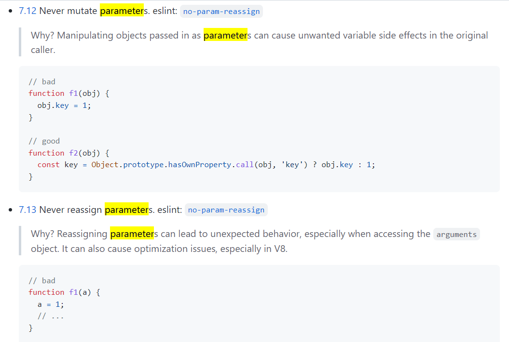
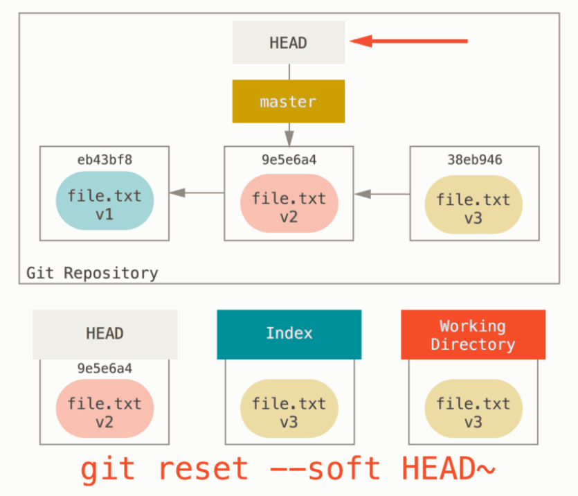
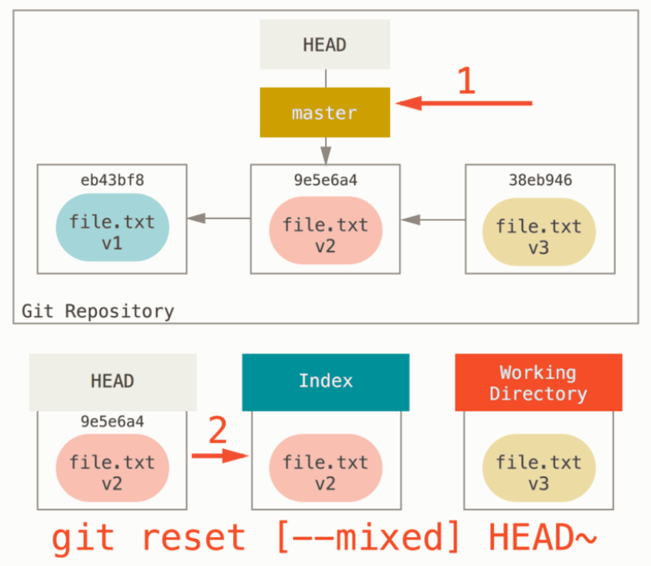

구조: MVC 패턴에 대한 고민
주석을 아무데나 막 썼는데 주석없이 잘 읽히도록 해야된다고 해서 이름 고민 많이 함
기능담위 커밋에 대해서 고민을 많이 하고 나를 위한 커밋이 아닌 다른 사람을 위한 커밋을 남기기 위해 노력
클린코드 책

## 1. 숫자 야구 게임

우아한테크코스 3기의 프리코스 1주차 미션은 숫자 야구 게임 구현이다. 구현 내용은 [프리코스 1주차 미션 저장소](https://github.com/DomMorello/javascript-baseball-precourse/tree/dom)에 업로드했다.

1주차 미션을 진행하면서 고민한 내용들에 대해 개인적으로 공부하고 정리해보았다.

<br>

## 2. Javascript 기초

VanillaJS 를 충분히 공부하지 않고 React를 다루다 보니 JS에 대한 기본기 훈련이 잘 안 돼있다고 생각한다. 그래서 이번 프리코스를 통해서 부족했던 JS 기본 역량을 보완하는 것이 목표 중에 하나이다. **모던 자바스크립트 Deep dive** 와 여러 레퍼런스를 참고해서 잘 몰랐던 내용에 대해서 정리하면서 학습했다.

### 2-1. new와 생성자 함수

```js
export default function BaseballGame() {
  // this = {};  (빈 객체가 암시적으로 만들어짐)

  this.play = function (computerInputNumbers, userInputNumbers) {
    return "결과 값 String";
  };

  // return this;  (this가 암시적으로 반환됨)
}
```
위 코드는 미션에서 주어지는 코드인데 `this` 키워드를 이용해서 함수를 정의하고 있고 함수의 컨벤션이 대문자로 시작하는 것으로 보아 생성자 함수임을 알 수 있다.

new BaseballGame()과 같이 코드를 작성하면

1. 빈 객체를 만들어 this에 할당한다.
2. 함수 본문을 실행한다. 위의 경우 this에 새로운 프로퍼티(play 함수)를 추가해 this를 수정한다.
3. this를 반환한다.

<br>

### 2-2. this

```js
let user = {
  firstName: "dom",
  sayHi() {
    let arrow = () => alert(this.firstName);
    arrow();
  }
};

user.sayHi(); // dom
```
화살표 함수는 일반 함수와는 다르게 `this`를 고유하게 갖지 않는다. 위와 같이 화살표 함수 내부에서 `this`를 쓰면 더 상위의 범위에서 `this`를 참조한다. 위 경우에서는 user 객체를 가리킨다.

즉, 별개의 this가 만들어지는 건 원하지 않고, 외부 컨텍스트에 있는 this를 이용하고 싶은 경우 화살표 함수가 유용하다.

<br>

### 2-3. forEach 문에서 조건 만족시 break 하기

`forEach` 반복문을 사용해서 검사를 하면서 어떤 조건을 만족하면 반복을 멈추고 `break`나 `return`을 사용해서 나오고 싶을 것이다. 조건을 찾았는데 계속해서 반복문을 찾는 것은 무의미하기 때문이다.

```js
const a = [1,2,3,4];

a.forEach((element) => {
    console.log(element);
    if (element === 2) return;
});

//outut
//1
//2
//3
//4
```
하지만 `forEach` 구문에서 어떤 조건을 만족했다고 해서 `return`을 해봤자 `forEach` 구문 내부의 콜백함수기 때문에 그 콜백함수만 빠져나오는 것이지 아무 의미가 없다. 위 코드를 실행해보면 1, 2 까지만 출력하고 3, 4는 실행하지 않을 것이라고 생각할 수도 있지만 이는 틀리다.

> 예외를 던지지 않고는 forEach()를 중간에 멈출 수 없습니다. 중간에 멈춰야 한다면 forEach()가 적절한 방법이 아닐지도 모릅니다.<br><br>
MDN – forEach

MDN 설명에 나와있듯이 `forEach` 에서 중간에 반복을 멈추고 나올 방법은 없다. 조건을 검색하는 반복에서는 이 함수를 사용하는 것이 적절하지 않다.

<br>

### 2-4. 옵셔널 체이닝 연산자
> ES11(ECMANSript2020)에서 도입된 옵셔널 체이닝 연산자 `?.` 는 좌항의 피연산자가 null 또는 undefined인 경우 undefined를 반환하고, 그렇지 않으면 우항의 프로퍼티 참조를 이어간다.<br><br>
모던 자바스크립트 Deep Dive p.122

사용자의 입력값인 `userInput` 을 받아오는데 여기서 유효하지 않은 값이 들어오면 `userInput`이 `null`이 되도록 했다. 그런데 return을 할 때 `userInput.join("")` 을 하는데 여기서 `userInput`이 null 이면 에러가 나는 상황에 봉착했다.

그래서 return을 하기 전에 null 검사를 해야 하는 상황인데 여기서 옵셔널 체이닝 연산자를 쓰지 않으면 다음과 같이 했었어야 했다.

```js
export default function getUserInput() {
  let userInput = null;
  const userInputArray = {
    ...
    userInput = userInputArray;
  }
  return userInput && userInput.join("");
  //여기서 userInput이 null일 수도 있기 때문에 && 연산자를 통해 검사
}
```
그런데 옵셔널 체이닝 연산자를 이용하면 다음과 같이 수정할 수 있다.

```js
export default function getUserInput() {
  let userInput = null;
  const userInputArray = {
    ...
    userInput = userInputArray;
  }
  return userInput?.join("");
  //옵셔널 체이닝 연산자 사용
}
```
위 코드와 같이 **옵셔널 체이닝 연산자**를 사용하면 userInput이 null이거나 undefined이면 undefined를 반환하고 아니라면 우항의 프로퍼티를 참조한다.

<br>

## 3. 구현 중에 했던 고민들

### 3-1. 첫 설계의 착오

코드를 짤 때 항상 필요없는 행동을 최소화하기 위해서 노력한다. 그래서 이 게임의 시작은 항상 사용자의 입력이 있는 순간 시작된다는 사실을 인지하고 사용자의 입력을 받는 것을 최우선으로 코드를 짜기 시작했다.

그런데 처음에 구현할 기능 순서대로 목록을 작성했는데 개발을 하다 보니 로직이 잘못 됐다는 것을 깨달았다. 사용자 입력이 있을 때 컴퓨터의 입력을 생성하고 비교하는 게임 로직을 실행하려고 했는데 사용자 입력을 받는 이벤트가 발생할 때마다 그 후에 종속적으로 computerInput을 랜덤생성하면 계속해서 computerInput이 사용자 입력이 있을 때마다 바뀌기 때문에 정답을 맞출 가능성이 현저히 떨어지고 게임의 본질적인 기능을 하지 못한다는 사실을 알았다.

그래서 처음 설계한 로직을 수정하여 컴퓨터의 입력값이 먼저 있는 상태에서 사용자의 입력을 받고 비교하여 게임을 진행하는 로직이 다음으로 오도록 수정했다.

> playGame.js
```js
export default function playGame(play) {
  const $userSubmitButton = document.querySelector("#submit");
  const computerInput = getComputerInput();

  $userSubmitButton.addEventListener("click", (event) => {
    event.preventDefault();
    const userInput = getUserInput();
    console.log("test: ", computerInput, userInput);
  });
}
```
위 코드와 같이 컴퓨터 입력 값을 먼저 생성한 후에 사용자의 입력값을 받고 그 두 개의 입력값을 비교하여 게임 로직을 실행하는 순서로 수정했다.

<br>

### 3-2. 함수를 기능 단위로 나눠야 한다 vs 구조적으로 가능한 설계를 해야 한다

원래는 이렇게 구조를 생각했다. 기능별로 함수를 나눠야 하기 때문에 `getUserInput` 함수에서는 userInput의 값을 검사해서 유효하면 얻어오도록 하려고 했다. 그런데 이벤트가 발생하는 시점에 콜백함수를 실행하는데 위와 같이 코드를 짜면 userInput에는 항상 null값만 들어온다. 왜냐하면 다른 곳에서 이 함수를 호출해서 return 값을 받아서 사용하려고 했는데 함수를 실행하는 시점에는 `userInput`에 null값이 들어가있기 때문이다. 즉, 야구게임의 경우 사용자의 입력을 받는 순간 그 콜백함수에서 모든 게임 로직이 연속되게 실행돼야 한다는 것이다. 이벤트가 발생했을 때마다 새로운 값을 return 받으려고 했지만 구조적으로 불가능하다는 사실을 알아서 다음과 같이 구조를 바꿨다.

> getUserInput.js
```js
export default function getUserInput() {
  const $userSubmitButton = document.querySelector("#submit");

  $userSubmitButton.addEventListener("click", (event) => {
    event.preventDefault();
    const userInputArray = document
      .querySelector("#user-input")
      .value.split("")
      .map((elem) => +elem);
    if (alertErrorMessage(isValidInput(userInputArray))) {
      compareComputerUserInput(getComputerInput(), userInputArray); //콜백함수 안에서 다음 게임 로직을 연속해서 실행
    }
  });
}
```
위 코드를 보면 userInput 값을 반환하는 것이 아니라 이 함수 안에서 이벤트가 발생하면 입력값의 유효성을 검사한 후에 게임로직을 이 콜백함수 안에서 연속해서 실행하는 것이다. 

게임이 진행되는 방식이 이벤트의 발생에 따라서 결과값을 보여줘야 하기 때문에 이렇게 하는 것이 옳은 구조라고 생각해서 바꾸게 되었다. 

하지만 이런 식으로 구조를 만들면 `getUserInput` 이라는 함수 안에서 게임로직까지 실행되므로 한 기능을 가진 함수를 실행하는 원칙에 어긋나고 유지보수하기 어려운 코드가 될 것이다.

그래서 이벤트리스너를 게임을 시작하는 로직에 모아두고 그 안에서 userInput을 받아오면 한 가지 기능을 하는 함수를 만들 수 있다는 생각이 들었다.

> playGame.js
```js
export default function playGame(play) {
  const $userSubmitButton = document.querySelector("#submit");

  $userSubmitButton.addEventListener("click", (event) => {
    event.preventDefault();
    const userInput = getUserInput();
    // userInput만 받아오는 한 가지 기능을 하는 함수
  });
}
```
> getUserInput.js
```js
export default function getUserInput() {
  let userInput = null;
  const userInputArray = document
    .querySelector("#user-input")
    .value.split("")
    .map((elem) => +elem);
  if (alertErrorMessage(isValidInput(userInputArray))) {
    userInput = userInputArray;
  }
  return userInput;
}
```
위와 같이 `playGame` 함수에서 전체적인 이벤트리스너 구조를 만들어 놓고 그 콜백함수 안에서 userInput을 받아오면 `getUserInput` 함수는 userInput을 받아오는 한 가지 기능을 하는 함수로 탈바꿈이 가능했다. 이렇게 구조를 바꾸니까 한 가지 기능을 가진 함수를 만들 수 있었고 구조적으로도 충분히 가능한 코드를 만들 수 있었다.

<br>

### 3-3. 상수는 어디에 위치해야 할까?
기능을 구현하다 보면 절대 변하지 않을 값들이 있고 이를 하드코딩하기 보다는 의미있는 이름을 지어줘서 상수에 할당해서 사용하는 것이 더 좋을 것이라고 생각했다. 

> getComputerInput.js
```js
const COMPUTER_INPUT_LENGTH = 3;

export default function getComputerInput() {
  const computerInput = new Set();

  while (computerInput.size < COMPUTER_INPUT_LENGTH) {
    computerInput.add(window.MissionUtils.Random.pickNumberInRange(1, 9));
  }
  return [...computerInput].join("");
}
```
위 코드를 보면 이 프로그램에서 컴퓨터 입력값은 무조건 3자리여야 한다. 그래서 `COMPUTER_INPUT_LENGTH`를 3 으로 정해놓고 사용을 했다. 연관있는 변수, 상수, 함수들은 전부 한 파일에 있는 것이 좋을 것이라고 생각해서 처음에 `getComputerInput.js` 파일 안에 상수를 위치시켜놨다.

그런데 기능 구현을 계속 하다보니까 사용자의 입력값의 길이를 사용해야 하는 경우가 있었다. 그래서 상수의 이름이 적절치 않다는 것을 깨닫고 `COMPUTER_INPUT_LENGTH` 에서 `INPUT_LENGTH`로 수정했다. 이 프로그램에서 컴퓨터, 사용자 모두의 입력값의 길이는 세 자리여야 하기 때문이다.

그리고 또 하나 문제가 `getComputerInput` 함수에서만 사용될 것 같았던 저 상수가 다른 파일의 다른 함수에서도 필요하다는 것을 알게 되었고 그래서 위 코드에서 상수부분에 **export** 를 추가해줬다. 이렇게 하면 다른 파일에서 **import** 해서 사용할 수 있기 때문이다.

그런데 이렇게 상수를 한 파일에 종속시키고 외부에서 필요하면 export 하고 import하는 과정을 반복하다보니 이 상수가 도대체 어디에 종속돼야 하고 어디에 연관성이 깊은 것인지를 알기가 어려워지는 것 같았다.

그래서 만약에 한 파일에서만 사용되는 상수가 아니고 **여러 파일에서 반복적으로 사용되는 상수라면** 독립적인 하나의 파일 안에 상수들만 모아놓는 것이 더 효율적일 것이라고 생각했다. 

한 파일안에서만 사용되는 상수라면 그 파일에 상수를 위치시키는 것이 더 좋겠지만 여러 파일에서 사용되는 상수라면 **독립적인 공간**에 두는 것이 export, import 관계도 더 명확해지고 논리적이라고 생각했다. 또한 다른 개발자가 내 코드를 볼 때 contant 라는 디렉토리 안에 상수를 모아놓으면 이 상수들은 여러 곳에서 사용된다는 것을 더 쉽게 유추할 수 있지 않을까라는 생각을 했다.

하지만 1주차 프로그램은 아주 작은 프로그램이라서 더 효율적인 것처럼 보이지만 큰 프로그램의 경우에는 어떤 식으로 상수를 위치시키는지에 대해서는 아직 확신이 없다. 앞으로도 계속 생각해볼 문제라고 생각한다.

### 3-4. HTML 태그는 어떤 방식으로 생성해야 할까?
기능을 구현하다가 DOM노드를 건드려야 하는 상황이 왔다. DOM노드를 JS를 통해 조작할 수 있는데 두 가지 방법 중에 무엇을 사용해야 하는지가 고민이었다. `createElement` 함수를 통해서 노드를 만들고 상위 함수를 찾아서 `append` 하는 방법이 있고, `innerHTML` 함수를 이용해서 문자열로 HTML 태그들을 만들어서 넣을 수 있다.

이 부분에 대해서 조사를 해봤는데 [이 포스트](https://www.javascripttutorial.net/javascript-dom/javascript-innerhtml-vs-createelement/)에 따르면 `createElement`로 생성하고 `append`로 붙이는 것이 성능 상 이점이 있다고 한다. `innerHTML`은 문자열을 파싱해서 내부적으로 DOM노드를 만들고 붙이는 작업을 하기 때문이다. 또한 `innerHTML`은 보안상 문제점이 있다. `innerHTML`의 위험성에 대해서 자세한 설명은 다음 게시글을 참고하면 좋다.

> [DOM Manipulation and the Dangers of ‘innerHTML’](https://betterprogramming.pub/dom-manipulation-the-dangers-of-innerhtml-602f4119d905)<br>
[MDN - Element.innerHTML Security considerations](https://developer.mozilla.org/en-US/docs/Web/API/Element/innerHTML)

`innerHTML`에 성능, 보안상 문제가 있지만 지금 내가 하고 있는 기능은 어떤 중요한 정보를 담고 있지도 않고 단순히 몇 개의 태그를 추가하는 것이기 때문에 가독성을 위해서 `innerHTML`방식을 채택했다.

> showResult.js
```js
function renderAskRegame() {
  const $resultDivElement = document.getElementById("result");
  const $newDivElement = document.createElement("div");
  const $newSpanElement = document.createElement("span");
  const $newButtonElement = document.createElement("button");
  $newDivElement.innerText = "🎉정답을 맞추셨습니다!🎉";
  $newDivElement.setAttribute("style", "font-weight: bold");
  $newSpanElement.innerText = "게임을 새로 시작하시겠습니까?";
  $newButtonElement.innerText = "게임 재시작";
  $newButtonElement.setAttribute("id", "game-restart-button");
  $resultDivElement.append($newDivElement);
  $resultDivElement.append($newSpanElement);
  $resultDivElement.append($newButtonElement);
}
```
위 코드를 보면 가독성이 별로 좋지 않다. 하지만 `innerHTML`을 사용하면 아래와 같이 간단하게 바뀔 수 있다.
> showResult.js
```js
function renderAskRestartView() {
  const $resultDiv = document.getElementById("result");
  $resultDiv.innerHTML = `
    <div>🎉<strong>정답을 맞추셨습니다!</strong>🎉</div>
    <span>게임을 새로 시작하시겠습니까?</span>
    <button id="game-restart-button">게임 재시작</button>
  `;
}
```
`innerHTML`을 사용하면 해당 DOM 노드 전체를 다시 파싱하고 만들기 때문에 이벤트 리스너가 있었다면 그 이벤트 리스너가 동작하지 않는 문제도 있다. 하지만 이 프로젝트의 경우 이벤트 리스너는 다른 곳에 있기 때문에 그 부분도 문제가 되지 않았다. 여러 단점에도 불구하고 내 경우에는 큰 문제가 되지 않는 단점들이기 때문에 상황에 맞게 적절하게 선택하면 될 것 같다.

<br>

### 3-5. call by reference 를 활용하는 것은 어떨까?
기능을 구현하다가 정답을 맞추고 `게임 재시작` 버튼을 누르면 **computerInput**을 세 자리 랜덤한 숫자로 다시 생성해야 했다.

> gameEventHandler.js
```js
export default function gameEventHandler(play) {
  const $userSubmitButton = document.getElementById("submit");
  const $userResultDiv = document.getElementById("result");
  let computerInput = getComputerInput();

  $userSubmitButton.addEventListener("click", (event) => {
    event.preventDefault();
    const userInput = getUserInput();
    if (userInput) {
      if (showResult(play(computerInput, userInput)) === ANSWER) {
        computerInput = getComputerInput();
        //게임 정답을 맞추면 computerInput을 다시 생성한다.
      }
    }
  });
}
```
위 코드에서처럼 정답을 맞추면 `computerInput`을 갱신하고 다시 게임을 처음부터 진행하도록 하려고 했는데 위 코드대로 하면 depth가 3이 돼버려서 원칙에 어긋나게 돼버린다.

그래서 생각한 것이 C 언어에서처럼 포인터를 매개변수로 넘겨주면 넘겨받은 함수에서 그 값의 주소값을 갖고 있기 때문에 그 값을 변경할 수가 있다. 이런 것을 **call by reference** 라고 하는데 값만 매개변수에 복사해서 인자로 넘기는 것이 아니라 그 값 자체의 메모리주소값을 참조할 수 있도록 넘기는 것이다.

```js
...
  $userSubmitButton.addEventListener("click", (event) => {
    event.preventDefault();
    const userInput = getUserInput();
    if (userInput) {
      showResult(play(computerInput, userInput), computerInput);
      //computerInput은 배열이기 때문에 call by reference로 넘어간다.
    }
  });

  //showResult.js
  function showResult(resultString, computerInput) {
    ...
    computerInput = getComputerInput();
    ...
  }
  //두 번째 매개변수로 받은 computerInput을 수정한다.
```
JS에서는 원시값이 아닌 것들은 매개변수로 넘어갈 때 **call by reference**로 넘어간다. 그래서 메모리 주소값을 참조하게 되므로 넘겨받은 함수에서 수정을 하면 원래의 값에도 영향을 미친다.

그래서 위 코드와 같이 `computerInput`을 매개변수로 넘기고 `showResult`함수 내부에서 `computerInput`을 수정하면 된다.

하지만, [에어비엔비 코드컨벤션](https://github.com/airbnb/javascript)에 따르면 위 행동을 금지한다.



1. 절대로 매개변수를 바꾸지 마세요. eslint: no-param-reassign
2. 절대로 매개변수를 재할당하지 마세요. eslint: no-param-reassign

매개변수로 전달된 객체를 조작하면 원래 호출처에서 원치 않는 사이드 이펙트를 일으킬 수 있다. 또한 매개변수를 재할당하는 것은 예측할 수 없는 결과를 불러 일으킨다. 특히 arguments 객체에 접근할 때이다. 또한 V8에서 최적화 문제를 일으킬 수도 있다.

프로젝트를 진행하면서 에어비엔비 컨벤션을 자주 확인하는데 **모든 컨벤션에는 이유가 있다**.

이러한 이유로 위와 같이 하지 않았고 구조를 바꾸는 방식으로 수정했다.

<br>

### 3-6. 변수를 항상 함수의 맨 위에 뒀었는데 다시 생각해보자.

원래 코딩을 할 떄 항상 습관적으로 함수 내부에서만 사용되는 변수들을 선언할 때 항상 위에 모아두는 버릇이 있었다. 정확히 왜 그렇게 하기 시작했는지 모르겠는데 함수 중간에 `const a = 10;` 이런 식으로 들어가있는 게 상당히 보기 싫었다.

그런데 기능 구현을 하다가 이런 경우가 있었다.

> showResult.js
```js
export default function showResult(resultString) {
  const $resultDiv = document.getElementById("result");

  if (resultString === ANSWER) {
    renderAskRestartView();
    return;
  }
  $resultDiv.innerText = resultString;
}
```
원래 내 코딩 스타일대로 했다면 위와 같이 했을 것이다. 그런데 위 함수의 로직을 보면 `resultString === ANSWER`인 경우에 다른 함수를 실행하고 이 함수는 `return`을 통해서 끝내버린다.
그렇게 되면 맨 위에 선언했던 `const $resultDiv = document.getElementById("result");` 이 상수 대입 연산은 실행해놓고 사용하지를 않고 함수가 끝나는 것이다. 게다가 DOM node를 불러오는 연산이기 때문에 다른 간단한 대입 연산보다는 분명히 더 무거운 행동일 것이다. 코드 스타일상 모든 변수,상수가 그 함수에서 사용된다면 맨 위에 모아서 선언하는 것은 좋은 방법이라고 생각한다. 하지만 위와 같은 경우에서는 예외처리를 먼저 해주고 변수, 상수를 선언하는 것이 맞는 것 같다. 

> showResult.js
```js
export default function showResult(resultString) {
  if (resultString === ANSWER) {
    renderAskRestartView();
    return;
  }
  const $resultDiv = document.getElementById("result");
  $resultDiv.innerText = resultString;
}
```
그래서 위와 같이 예외처리를 먼저 해주고 그 다음에 `const $resultDiv = document.getElementById("result")` 와 같이 선언 및 대입을 해주는 것이 더 맞는 방법이라고 생각한다. 

<br>

### 3-7. 

## 4. git

### 4-1. git reset --hard 실수
여러 디렉토리가 있는 프로젝트를 진행하는 중에 현재 디렉토리의 위치를 모르고 `git add .` 명령어를 통해서 commit 을 하는 경우가 있다. 그런데 add할 파일들이 여러 개가 있는데 현재 디렉토리의 위치가 하위 디렉토리에 있다는 것을 모르고 전체가 다 add된 줄 알고 진행을 해버렸다. 

결국엔 commit에 포함돼야 할 상위 디렉토리의 파일들을 제외하고 commit을 해버려서 기능 단위의 커밋 로그 작성이 실패한 적이 있었다.

그래서 commit을 취소하는 방법에 대해서 조사를 하다가 **git reset** 명령어에 대해서 공부하게 됐다.

`git reset` 과 `git checkout`의 차이는 reset은 브랜치를 바꾸지 않고 현재 가리키고 있는 헤드의 위치를 바꾸는 것이다. 이와는 다르게 checkout은 브랜치 자체를 바꿔버린다.



위 그림을 이해하기 위한 설명을 하자면 아래 쪽에 있는 HEAD, Index, Working Directory를 각각 설명하자면,

> **HEAD**는 현재 브랜치가 가리키는 포인터이다. 가장 최근에 commit한 내용을 가리키고 있다.<br>
**Index**는 바로 다음에 커밋할 것들이다. 즉, staging area를 말한다.즉, `git add` 까지 한 파일들을 말한다.<br>
**Working Directory**는 현재 로컬에서 가장 최근까지 수정한 코드들을 담고 있는 파일들이다. <br>

위 그림에서 보다시피 `git reset --soft HEAD~` 를 하면 브랜치의 헤드의 위치만 원하는 commit 으로 되돌린다. 그림 아래 쪽에 Index와 Working Directory 를 보면 변화가 없이 그대로 있고 HEAD 부분만 이전의 commit으로 돌아간 것을 확인할 수 있다.



그런데 옵션을 주지 않으면 기본값을 `git reset --mixed HEAD~` 명령어를 실행하게 된다. 

위 그림에서 보면 헤드가 이전 커밋으로 이동하는 것 뿐 아니라 `soft`옵션과 다르게 Index 가 이전 커밋 내용으로 변경되는 것이다. 이 말은 staging area를 비운다는 것이다. 즉, `git add`, `git commit` 한 행동까지 되돌린다는 것이다. 하지만 working directory가 그대로 있다는 얘기는 파일이 수정된 것은 로컬에 그대로 남아있다는 것을 의미한다.

그렇다면 내가 실수한 `git reset --hard` 는 무엇일까?


위 그림을 보면 Working Directory까지 그 전 커밋 내용으로 변경된 것을 볼 수 있다. 즉, 내가 작업하고 있는 로컬 환경에서도 과거로 이동하는 것이다. 그런데 이 명령어는 매우 위험하다. git에서 실제로 데이터를 삭제해버리는 경우는 별로 없는데 이 경우가 데이터를 삭제하는 경우 중의 하나이다. 

나는 마지막 커밋을 수정하기 위해서 `--hard`옵션을 줬는데 이렇게 했더니 최근에 수정한 코드들이 전부 날아가 버렸다. 

이제 `git reset` 명령어에 대해서 다시 공부를 해서 그런 실수를 하는 일이 없도록 했다.

<br>


<br>

---

## References

* 모던 자바스크립트 Deep Dive (이웅모 저)
* [모던 자바스크립트 튜토리얼](https://ko.javascript.info/)
* [git reset 자세히 알기](https://git-scm.com/book/ko/v2/Git-%EB%8F%84%EA%B5%AC-Reset-%EB%AA%85%ED%99%95%ED%9E%88-%EC%95%8C%EA%B3%A0-%EA%B0%80%EA%B8%B0)
* [DOM 생성 방법에 대한 스택오버플로우 문답](https://stackoverflow.com/questions/11550461/when-do-you-use-dom-based-generation-vs-using-strings-innerhtml-jquery-to-gener)
* [createElement vs innerHTML](https://www.javascripttutorial.net/javascript-dom/javascript-innerhtml-vs-createelement/)
* [MDN](https://developer.mozilla.org/en-US/)